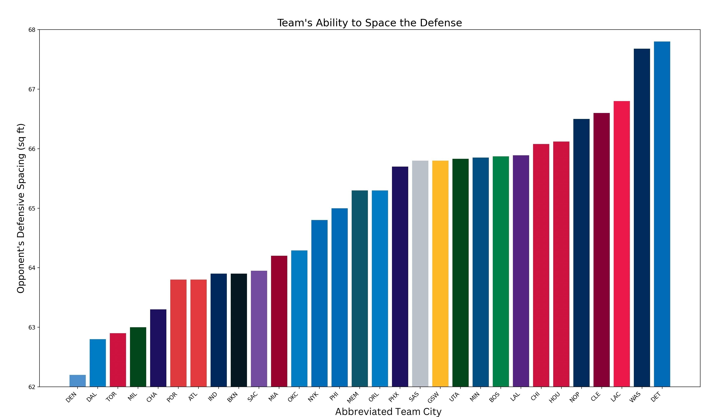

# NBA Team Spacing Visualizer

This project visualizes NBA team defensive spacing and performs linear regression on team statistics using positional data. By analyzing convex hull areas of team formations, the system generates insights into team defensive spacing and its correlation with performance metrics like score differentials. The project is built using Python and various data processing, visualization, and animation libraries.

## Features

- **Team Spacing Analysis**: Visualizes the convex hull of player positions to analyze team spacing.
- **Linear Regression**: Performs linear regression to correlate home team defensive spacing differential with home team score differential.
- **Animation**: Displays animated GIFs of team movements and defensive spacing in real time.
- **Bar Graphs**: Showcases defensive spacing for each NBA team using bar graph visualizations.

## Data

Below are some examples generated by the system:

- **Bulls vs Thunder Game Animation**:
  

- **Pelicans vs Clippers Game Animation**:
  

- **Bulls vs Bucks Defensive Spacing**:
  

- **Hawks vs Pelicans Defensive Spacing**:
  

- **Bar Graph of Team Defensive Spacing**:
  

- **Linear Regression of Defensive Spacing vs Score Differential**:
  

## Installation

To set up and run the visualizer, follow these steps:

1. **Clone the repository**:
    ```bash
    git clone https://github.com/jgottlieb11/nba-team-spacing-visualizer.git
    cd nba-team-spacing-visualizer
    ```

2. **Install the required dependencies**:
    ```bash
    pip install -r requirements.txt
    ```

3a. **Run the team movement visualization**:
    ```bash
    python launch_game.py --path=<path-to-7z-file> --event=<event-in-game>
    EX: python launch_game.py --path=data/2016.NBA.Raw.SportVU.Game.Logs/01.01.2016.NYK.at.CHI.7z --event=1  
    ```
3b. **Run the team defense visualization**:
    ```bash
    python team_spacing.py --path=<path-to-7z-file> --team=<home-or-away>
    EX: python team_spacing.py --path=data/2016.NBA.Raw.SportVU.Game.Logs/01.02.2016.PHI.at.LAC.7z --team=home
    ```


## Usage

- **Team Spacing Animation**: The system can animate player movements and spacing using game event data in `.7z` or `.json` formats. The animations show how teams position themselves defensively or offensively over the course of a game.
- **Defensive Spacing Analysis**: The system provides a bar graph visualization of average opponent defensive spacing for various teams, offering insights into team strategies and performance.
- **Linear Regression**: The system performs linear regression to determine the relationship between defensive spacing differential and score differential.
